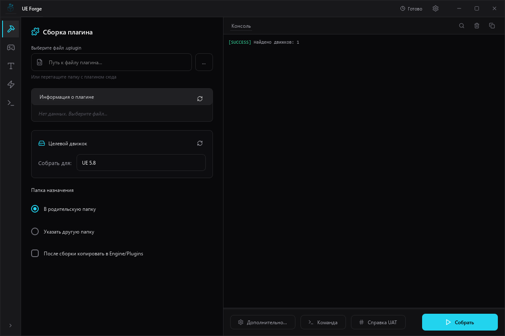
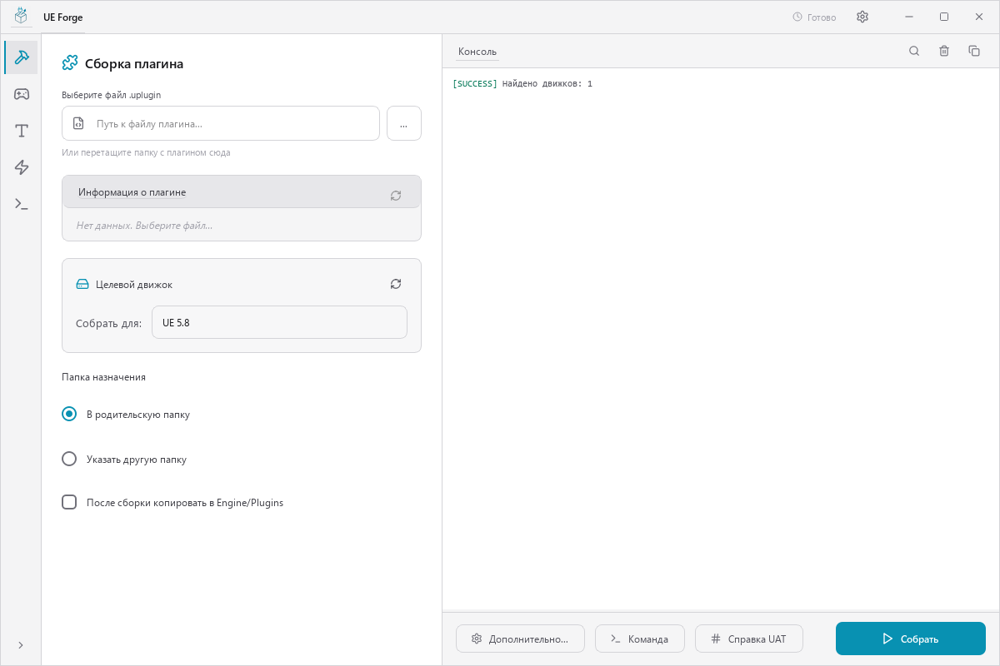
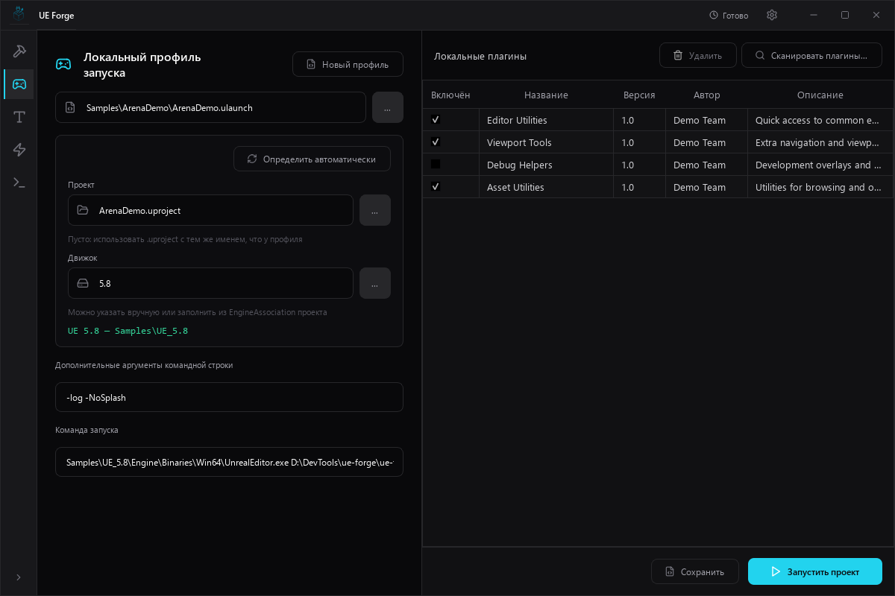
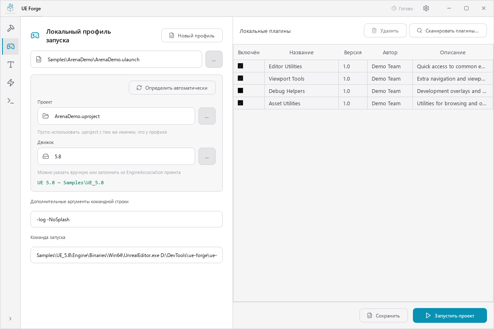
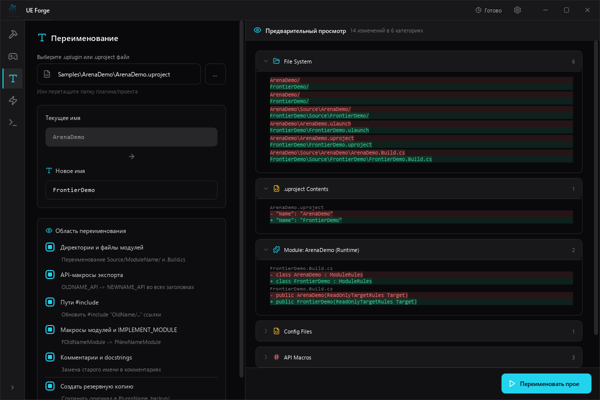
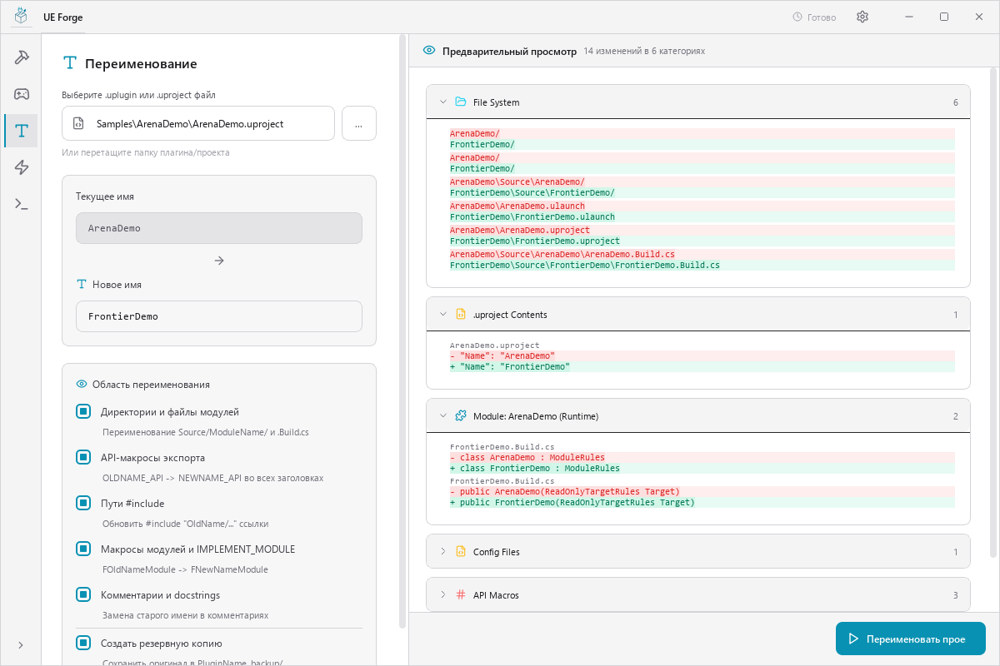
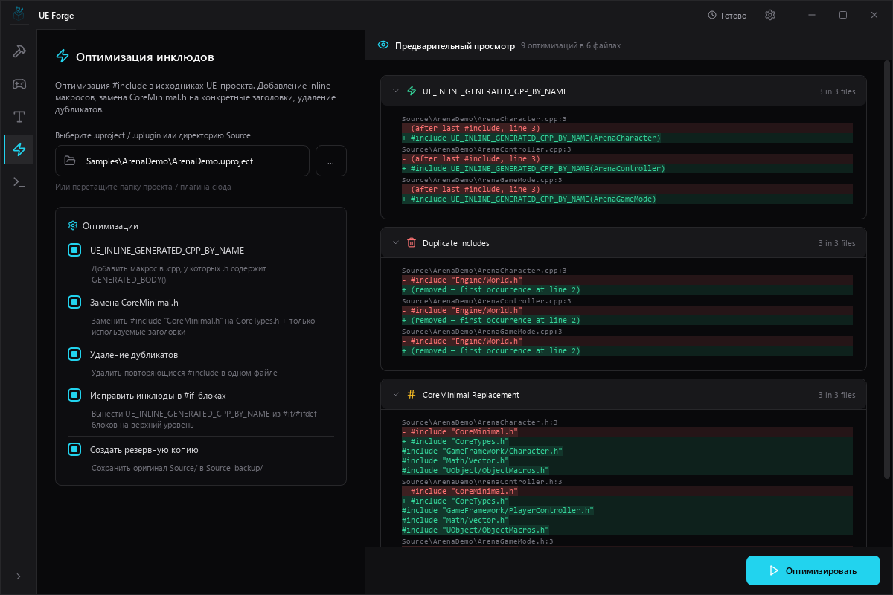
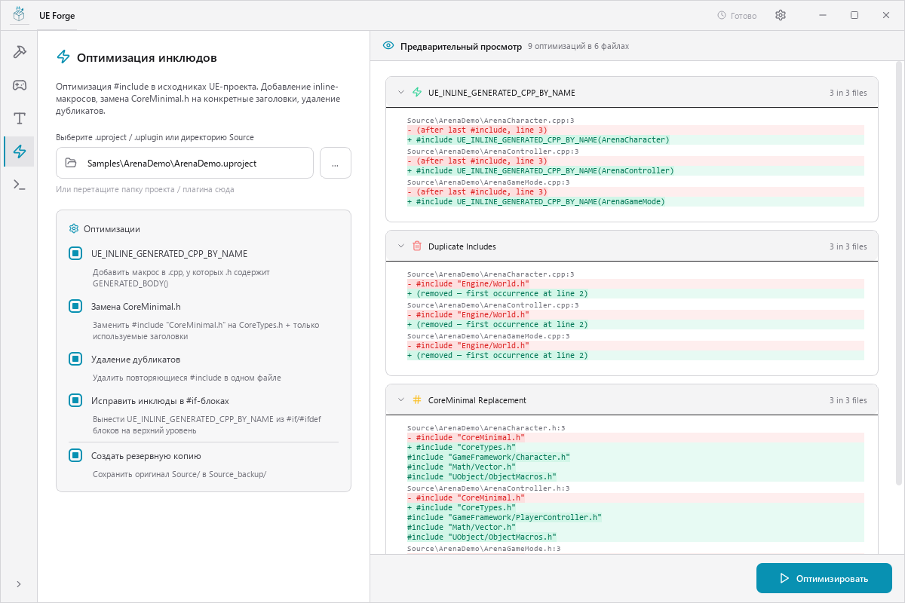
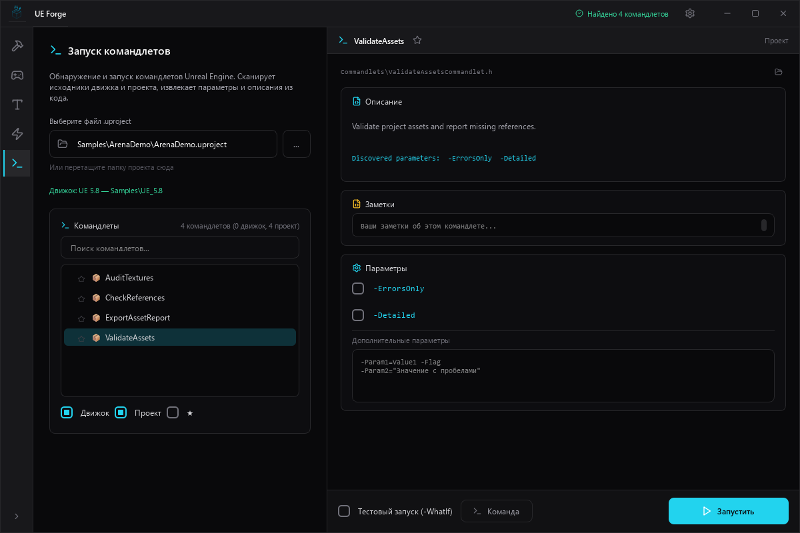
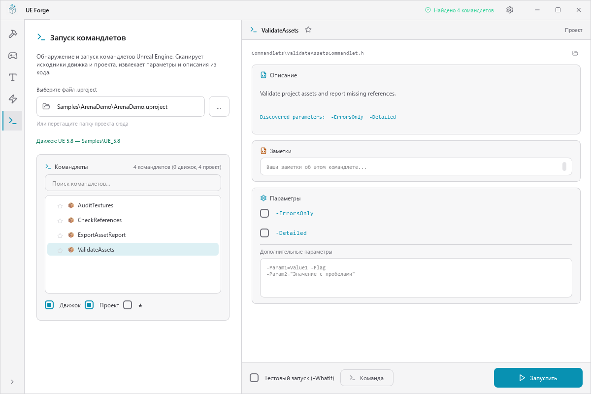

# UE Forge

**[English](README.md) | Русский**

Десктопный тулкит для автоматизации работы с Unreal Engine. Frameless UI со светлой и тёмной темами, модульная архитектура страниц, работает отдельно или как единое приложение.


> **Заметка**: Этот проект заменяет [Unreal-Engine-Plugin-Builder](https://github.com/PsinaDev/Unreal-Engine-Plugin-Builder), который теперь в архиве.

---

## Инструменты

UE Forge — хост-окно с сайдбаром, в которое загружаются страницы инструментов. Каждый инструмент можно также запустить отдельно.

Все инструменты поддерживают тёмную и светлую темы. Нажмите на скриншот, чтобы открыть его в полном размере.

### [Plugin Builder](ue_forge/plugin_builder/docs/README_RU.md)

| Тёмная тема | Светлая тема |
|:---:|:---:|
| <a href="ue_forge/plugin_builder/screenshots/plugin_builder_ru.png"></a> | <a href="ue_forge/plugin_builder/screenshots/plugin_builder_ru_light.png"></a> |

Сборка UE-плагинов из исходников через UAT. Автоматическое обнаружение установленных движков, валидация `.uplugin`, живая консоль сборки. Расширенные флаги, выбор платформ, настройки на каждый движок.

### [UProject Launcher](ue_forge/uproject_launcher/docs/README_RU.md)

| Тёмная тема | Светлая тема |
|:---:|:---:|
| <a href="ue_forge/uproject_launcher/screenshots/uproject_launcher_ru.png"></a> | <a href="ue_forge/uproject_launcher/screenshots/uproject_launcher_ru_light.png"></a> |

Запуск Unreal-проекта с персональными плагинами движка, включёнными только для текущего процесса. Профиль `.ulaunch` хранит пути к проекту и движку, выбор плагинов и дополнительные аргументы, не изменяя общий `.uproject`.

### [Renamer](ue_forge/renamer/docs/README_RU.md)

| Тёмная тема | Светлая тема |
|:---:|:---:|
| <a href="ue_forge/renamer/screenshots/renamer_ru.png"></a> | <a href="ue_forge/renamer/screenshots/renamer_ru_light.png"></a> |

Полное переименование UE-плагинов и проектов. Обрабатывает `.uplugin` / `.uproject` JSON, имена классов и конструкторы в `.Build.cs`, API-макросы, include guard'ы, `IMPLEMENT_MODULE`, конфиги, комментарии. Diff-превью перед применением, бэкап при выполнении.

### [Include Optimizer](ue_forge/include_optimizer/docs/README_RU.md)

| Тёмная тема | Светлая тема |
|:---:|:---:|
| <a href="ue_forge/include_optimizer/screenshots/include_optimizer_ru.png"></a> | <a href="ue_forge/include_optimizer/screenshots/include_optimizer_ru_light.png"></a> |

Оптимизация `#include` в C++ исходниках UE-проекта. Добавляет отсутствующие `UE_INLINE_GENERATED_CPP_BY_NAME`, заменяет `CoreMinimal.h` на конкретные используемые заголовки, удаляет дубликаты, исправляет инклюды внутри препроцессорных блоков. Рекурсивное сканирование плагинов с исключением по чекбоксам.

### [Commandlet Runner](ue_forge/commandlet_runner/docs/README_RU.md)

| Тёмная тема | Светлая тема |
|:---:|:---:|
| <a href="ue_forge/commandlet_runner/screenshots/comandlet_runner_ru.png"></a> | <a href="ue_forge/commandlet_runner/screenshots/comandlet_runner_ru_light.png"></a> |

Обнаружение и запуск UE-командлетов. Сканирует исходники движка и проекта на `UCommandlet` подклассы, извлекает описания из комментариев и `HelpDescription`, генерирует usage из паттернов `FParse::Param`. Избранное, заметки, живой вывод консоли.

---

## Архитектура

```
framekit/                  # Переиспользуемое UI-шасси — ничего не знает про Unreal
├── styles.py              # Цвета, шрифты, радиусы (zinc + cyan тема)
├── icons.py               # Рендер SVG-иконок Lucide
├── localization.py        # i18n (EN/RU), регистрация по модулям
├── config.py              # Персистентные настройки (JSON)
├── platform.py            # Конфиг-пути по ОС + управление процессами
├── app.py                 # Бутстрап run_host() / run_standalone()
├── widgets/               # PathInput, ConsoleWidget, StatusBadge, ScrollingLabel
├── dialogs/               # MessageDialog, SettingsDialog
└── shell/                 # HostWindow (сайдбар), SinglePageShell, протокол ToolPage

ue_forge/
├── config.py              # Настройки UE — движки, опции сборки, избранное, заметки
├── platform.py            # Платформа UE — поиск движков, имена UAT/редактора
├── assets.py              # Поиск ресурсов (dev + frozen)
├── resources/             # Иконка приложения
├── plugin_builder/        # Модуль Plugin Builder
├── uproject_launcher/     # Модуль запуска проектов
├── renamer/               # Модуль Renamer
├── include_optimizer/     # Модуль Include Optimizer
├── commandlet_runner/     # Модуль Commandlet Runner
└── __main__.py            # Единая точка входа

pyside_frameless/          # Git-подмодуль → github.com/PsinaDev/pyside-frameless
├── frameless_window.py    # FramelessWindow с Aero Snap
└── drop_overlay.py        # Анимированный оверлей для drag-and-drop
```

UE Forge построен на **framekit** — самодостаточном UI-шасси (тематические виджеты, диалоги, хост- и standalone-оболочки, JSON-конфиг, локализация и бутстрап одним вызовом) без какого-либо UE-специфичного кода. `ue_forge` добавляет сверху специфику UE: поиск движков, автоматизацию сборки и страницы инструментов. Каждая страница реализует один контракт `ToolPage`, поэтому встаёт и в общее хост-окно, и в собственную standalone-оболочку.

Каждый модуль следует одной структуре: `core.py` (чистый Python, без Qt), `page.py` (PySide6 UI), `strings.py` (переводы), `__main__.py` (standalone точка входа).

## Установка

```bash
git clone --recurse-submodules https://github.com/PsinaDev/ue-forge.git
cd ue-forge
pip install -r requirements.txt
```

### Запуск

```bash
# Все инструменты в одном окне
python -m ue_forge

# Отдельные инструменты
python -m ue_forge.plugin_builder
python -m ue_forge.uproject_launcher
python -m ue_forge.renamer
python -m ue_forge.include_optimizer
python -m ue_forge.commandlet_runner
```

### Сборка standalone exe

Запустите `tools/build-forge.ps1`, чтобы собрать общее приложение, или `tools/build-all.ps1`, чтобы собрать Forge и все standalone-инструменты через PowerShell 7. Также можно использовать командную строку:

```bash
pip install pyinstaller
pyinstaller specs/ue_forge.spec
```

Сборка отдельных инструментов: `specs/plugin_builder.spec`, `specs/uproject_launcher.spec`, `specs/renamer.spec`, `specs/include_optimizer.spec`, `specs/commandlet_runner.spec`.

В `tools/` доступны PowerShell-скрипты: `build-all.ps1`, `build-forge.ps1`, `build-plugin-builder.ps1`, `build-uproject-launcher.ps1`, `build-renamer.ps1`, `build-include-optimizer.ps1` и `build-commandlet-runner.ps1`.

## Зависимости

- **Python** ≥ 3.10
- **PySide6** ≥ 6.5
- **Pillow** ≥ 12.0
- **[pyside-frameless](https://github.com/PsinaDev/pyside-frameless)** — frameless-окно с Aero Snap (git-подмодуль)

## Лицензия

[MIT](LICENSE)
