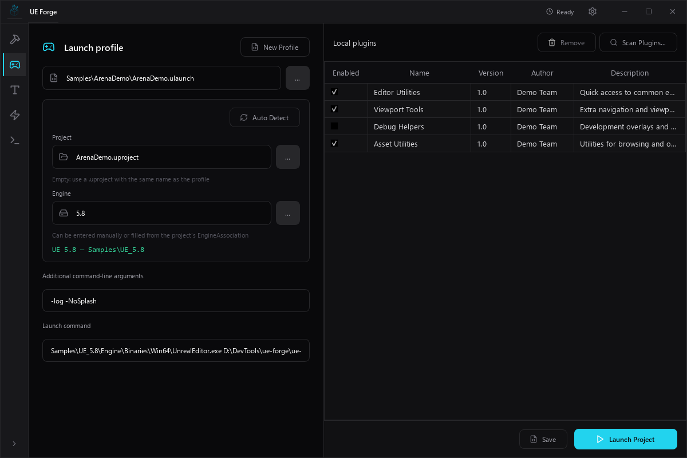
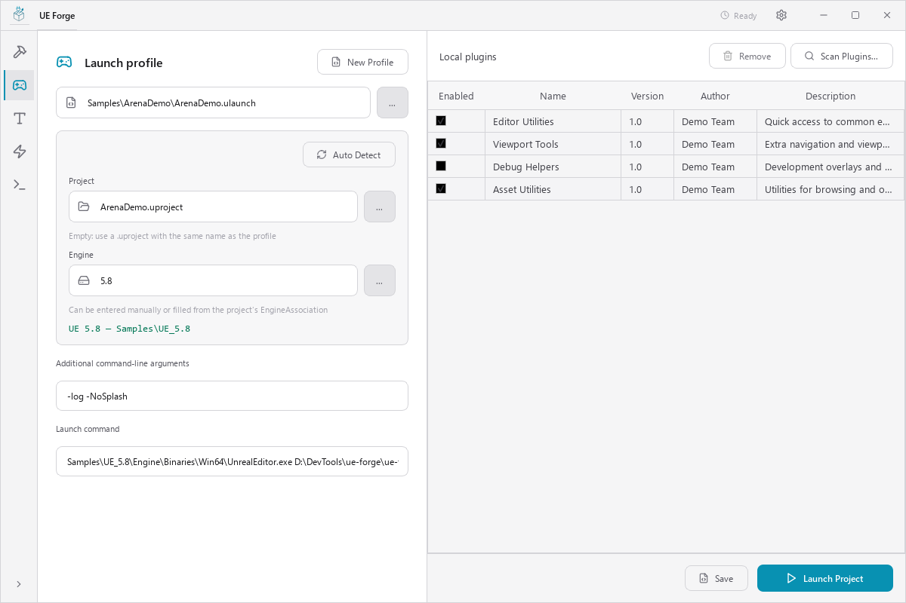

# UProject Launcher

UProject Launcher opens an Unreal Engine project with selected engine plugins enabled only for that editor process. The project descriptor remains unchanged.

| Dark theme | Light theme |
|:---:|:---:|
| <a href="../screenshots/uproject_launcher_en.png"></a> | <a href="../screenshots/uproject_launcher_en_light.png"></a> |

Launch settings appear on the left and the plugin list on the right. The settings scroll in smaller windows; Save and Launch Project remain visible below the plugin list. Both the standalone launcher and UE Forge use this layout.

Drop a single `.ulaunch` file onto either launcher panel to open it for editing. Unsaved changes require confirmation before another profile opens. Dropping a profile does not launch Unreal Editor.

## Profile format

A `.ulaunch` profile is JSON:

```json
{
  "FileVersion": 1,
  "Project": "MyProject.uproject",
  "Engine": "C:/Program Files/Epic Games/UE_5.8",
  "Plugins": [
    {
      "Name": "MyLocalPlugin",
      "Enabled": true
    }
  ],
  "Arguments": "-log -NoSplash"
}
```

`Project` can be absolute or relative to the profile. When omitted, the launcher uses the `.uproject` beside the profile with the same base name. `Engine` can be an engine root path or a registered version. Auto Detect fills both fields from the profile name and the project's `EngineAssociation`. Disabled plugin entries remain in the profile but are not passed to Unreal Editor.

Auto Detect requires the project `EngineAssociation` to match a registered engine. A manually entered engine root can also be used. Plugin scanning reads that engine's `Engine/Plugins` directory and supports filtering by plugin name, author, version, and description.

The profile is local data. The launcher does not modify `.gitignore` or `.git/info/exclude`.

In launcher settings, open **System** and click **Register .ulaunch**. Double-clicking a profile launches its project. The classic context menu contains **Launch Project** and **Edit profile**; in Windows 11, open **Show more options** to access them. Registration applies immediately to the current Windows account and supports both UE Forge and the standalone launcher. Register again if the executable moves.

If Windows already has another default application for `.ulaunch`, use **Windows default apps** to select **UE Forge UProject Launcher** for that extension. Registration preserves the existing Windows user choice.

The standalone launcher accepts a profile path or `--launch-profile <profile>`. UE Forge also accepts `--launch-profile <profile>`. Adding `--open` opens the profile for editing without launching.
